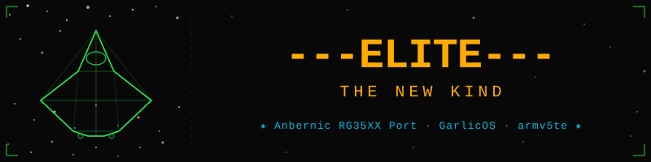

<p align="center">
  
</p>

<p align="center">
  
  
  
  
  
</p>

<p align="center">
  Native port of <strong>Elite: The New Kind</strong> to the <strong>Anbernic RG35XX</strong> (GarlicOS).<br/>
  Cross-compiled from the SDL2 <a href="https://github.com/lgblgblgb/newkind">lgblgblgb fork</a>
  via a custom SDL 1.2 backport shim — software-rendered, no GPU required.
</p>

---

## Screenshots

> Captured from the headless x86 simulator (`docker compose run --rm sim`).

<p align="center">
<table>
<tr>
  <td align="center"><br/><sub>Title screen / intro</sub></td>
  <td align="center"><br/><sub>Ship intro parade — Cobra Mk III</sub></td>
</tr>
<tr>
  <td align="center"><br/><sub>Front view — planet approach</sub></td>
  <td align="center"><br/><sub>Commander Jameson status screen</sub></td>
</tr>
</table>
</p>

---

## Status

| # | Task | Done |
|:--|:-----|:----:|
| 00 | Environment & toolchain | ✅ |
| 01 | Source & engine selection | ✅ |
| 02 | Hello-world pipeline test | ✅ |
| 03 | Dependencies | ✅ |
| 04 | Build the engine (`EliteTNK` — armv5te/uClibc, ABI pass) | ✅ |
| 05 | Display & scaling — 640×480 | 🔄 |
| 06 | Input mapping — gamepad controls | ⬜ |
| 07 | Audio | ⬜ |
| 08 | Packaging & deploy — GarlicOS Ports menu | ⬜ |
| 09 | Testing (ABI, smoke, perf, input, memory, save) | ⬜ |
| 10 | Polish (saves, sleep/wake, splash screen) | ⬜ |

---

## Requirements

**Build machine:** Docker Desktop (Windows / macOS / Linux). No native cross-compiler needed.

**Target device:**

| Property | Value |
|:---------|:------|
| Device   | Anbernic RG35XX (original, not Plus/H/SP) |
| OS       | GarlicOS |
| CPU      | Actions ATM7039S · ARM Cortex-A9 |
| ABI      | armv5te · uClibc · soft-float |
| RAM      | 256 MB |
| Display  | 640 × 480 |
| SDL      | 1.2 (on-board — no bundled libs needed) |

---

## Building from Source

```sh
# 1. Clone (engine submodule included)
git clone --recurse-submodules <this-repo>

# 2. Cross-compile the engine (outputs → port/Elite/EliteTNK)
docker compose run --rm engine

# 3. Verify the ABI
bash scripts/check-abi.sh
```

Other compose targets:

```sh
docker compose run --rm hello   # quick hello-world pipeline test
docker compose run --rm sim     # headless simulator → sim/*.png screenshots
docker compose run --rm shell   # interactive cross-compile shell
```

---

## Install — Drag & Drop

> **Prerequisites:** `EliteTNK` built (step above) and game data files in `port/Elite/data/`.

### Option A — packaging script

```sh
bash scripts/make-port.sh
# Creates: dist/Elite-RG35XX.zip
```

Unzip `Elite-RG35XX.zip` directly onto the **root** of your RG35XX SD card.
The archive contains the correct `Roms/PORTS/` structure.

### Option B — manual copy

Copy these two items to `Roms/PORTS/` on the SD card:

```
Roms/PORTS/
├── Elite.sh          ← from  port/Elite.sh
└── Elite/            ← from  port/Elite/
    ├── EliteTNK
    ├── data/
    └── libs/         (empty on the SDL 1.2 path)
```

Reload GarlicOS → **Ports** menu → **Elite**.

---

## Controls

Full mapping: **[docs/CONTROLS.md](docs/CONTROLS.md)**

### Quick Reference

| Action | Button |
|:-------|:------:|
| Pitch Up / Down | D-pad ↑ / ↓ |
| Roll Left / Right | D-pad ← / → |
| Accelerate | R |
| Decelerate | L |
| Fire Laser | A |
| Target Missile | X |
| Fire Missile | Y |
| ECM | L + R |
| Hyperspace / Jump | Start |
| Launch (docked) | Select + D-pad Up |
| Views (F1–F4) | Select + D-pad |
| Charts / Screens (F5–F11) | Select + A / B / X / Y / L / R |
| Combat actions (missile, ECM, bomb…) | Start + face button |
| Pause / Resume | Menu |
| Options / Save | Start + D-pad Right |

---

## Project Layout

```
engine/newkind/         Engine source (lgblgblgb fork + SDL 1.2 shim)
  sdl12_compat.c/.h     SDL2 → SDL 1.2 backport layer
port/
  Elite.sh              GarlicOS launcher script
  Elite/                Deploy payload (binary + data + libs)
scripts/
  30-build-engine.sh    Cross-compile pipeline
  40-build-sim.sh       Headless x86 simulator build
  make-port.sh          Package → dist/Elite-RG35XX.zip
docs/
  DEVICE-ABI.md         Confirmed device ABI & toolchain facts
  CONTROLS.md           Full gamepad control scheme
  BACKPORT-SDL12.md     SDL 1.2 backport implementation notes
tasks/                  Ordered, self-contained implementation tasks (00–10)
sim/                    Simulator output frames (screenshots)
```

---

## Technical Notes

The original RG35XX ships **SDL 1.2** (not SDL2). Rather than bundling a full SDL2 build, the
SDL2 calls in the newkind source are wrapped by a thin **`sdl12_compat`** shim
(`engine/newkind/sdl12_compat.c`) that maps them 1:1 to SDL 1.2 — window/texture → `SDL_Surface`,
`SDL_OpenAudio` unchanged, `SDL_gfx` same author. No bundled libraries, no GPU dependency.

Build uses the **MiyooCFW uClibc Docker toolchain** (`miyoocfw/toolchain-shared-uclibc:docker`),
the same pipeline proven by the EverlastingSummer port.

---

## Legal

Elite © Ian Bell & David Braben. *Elite: The New Kind* is Christian Pinder's fan
reimplementation (free to build since ~2014). This port is **personal and non-distributed**.
Do not redistribute binaries or commit non-free game data files.

See [Elite-Port-MASTER.md](Elite-Port-MASTER.md) for the full plan, approach, and task sequencing.
